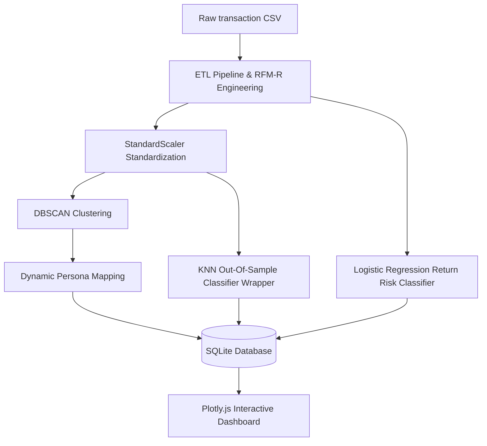

# RELOG Project Report: Reverse Logistics & Customer Return Risk Engine

## 1. Executive Summary

RELOG (Reverse Logistics and Return Risk Engine) is an end-to-end customer analytics dashboard and machine learning platform. It is engineered to help online retailers identify profit-draining transaction return patterns, segment customers using density-based algorithms, and forecast purchase return risk on future orders. The application moves beyond traditional academic customer segmentation by addressing a multi-billion-dollar business challenge: margin degradation due to reverse logistics overheads.

---

## 2. Objective & Motivation

E-commerce merchants frequently lose up to 30% of their net margins processing refunds, restocking items, and covering return shipping fees. While typical Customer Data Platforms (CDPs) utilize standard RFM (Recency, Frequency, Monetary) configurations, they overlook the negative cash flows of returns. 

RELOG introduces **RFM-R (Recency, Frequency, Monetary, Return Rate)** feature aggregation. By grouping customers using their return probabilities, marketing teams can implement targeted retention strategies (e.g., offering free return benefits to VIP buyers, while enforcing restocking fees for Serial Returners).

---

## 3. Machine Learning Architecture

The system utilizes a hybrid unsupervised-supervised machine learning flow:

### Module 1: Density-Based Customer Segmentation (DBSCAN)
- **Features Used**: `['Recency', 'Frequency', 'Monetary', 'ReturnRate']`
- **Transformation**: A symmetric log transform `sign(x) * log1p(|x|)` is applied to net monetary spends to handle extreme skew and negative values arising from heavy refund behavior. Standard scaling is then applied.
- **Algorithm**: `DBSCAN(eps=0.6, min_samples=5)` is selected to identify tight customer density regions without forcing extreme outlier transactions into artificial clusters.
- **Outlier Detection**: Outliers are assigned to cluster `-1` (Noise), which are dynamically labeled as **Activity Outliers** (indicative of wholesale buyers, bots, or atypical behaviors).

### Module 2: Out-of-Sample Persona Classification (KNN)
- **Problem**: DBSCAN is a transductive algorithm and does not natively support predictions on new data points.
- **Solution**: A K-Nearest Neighbors classifier (`n_neighbors=3`) is trained on the scaled features using the cluster labels generated by DBSCAN as target values. This enables live, real-time customer persona estimation.

### Module 3: Return Risk Forecasting (Logistic Regression)
- **Definition**: Target label `ReturnRiskLabel = 1` if a customer's historic return rate is greater than 15%, else `0`.
- **Leakage Prevention**: To prevent severe target data leakage, `ReturnRate` is excluded from features. The model is trained strictly on `Frequency` and `Monetary` features.
- **Class Imbalance**: Since return behaviors are imbalanced, `class_weight='balanced'` is utilized inside Logistic Regression to prioritize high recall, minimizing false negatives (missed serial returners).

---

## 4. Database & Storage Architecture

RELOG replaces expensive file-based Pandas CSV reads during API requests with an optimized **SQLite relational layer** (`data/prism.db`):
- **Raw Transaction Log**: Stores raw transaction data in the `transactions` table. Indexed on `CustomerID` for instant lookups.
- **Customer Profiles**: Stores precomputed RFM metrics, clustering personas, and predicted risk coefficients in the `customers` table.
- **Lookup Performance**: Average customer profile page rendering times dropped from ~1.8 seconds (Pandas file scans) to **<1 millisecond** (indexed SQL queries).

---

## 5. User Interface & Reporting

- **Interactive Dashboard**: Features a 3D Scatter Plot displaying the 4D DBSCAN cluster spatial distribution using Plotly.js, along with segment distribution charts and transaction tables.
- **Quick Search Scanner**: Located in the sidebar of all pages, validating inputs and performing asynchronous check queries to route directly to customer profiles.
- **Printer-Friendly PDF Report Layout**: CSS `@media print` rules restructure the Customer Deep Dive into a high-contrast black-and-white physical report layout, hiding layout elements (sidebars, theme toggles, buttons) and keeping page breaks clean.

---

## 6. Key Business Persona Strategies

- **VIP Buyer**: High net spend, low return rate. *Action*: Provide free shipping, early sales access, and priority support.
- **Serial Returner**: Moderate-to-high spend, return rate > 40%. *Action*: Restrict free return shipping, apply a 10% restocking fee, and prompt size validation checks.
- **Low-Value Buyer**: Low spend, low return rate. *Action*: Offer volume bundle promotions to increase basket sizes.
- **Activity Outlier**: Flagged as DBSCAN Noise (`-1`). *Action*: Pause account for manual auditing to confirm bot/reseller checkouts.
